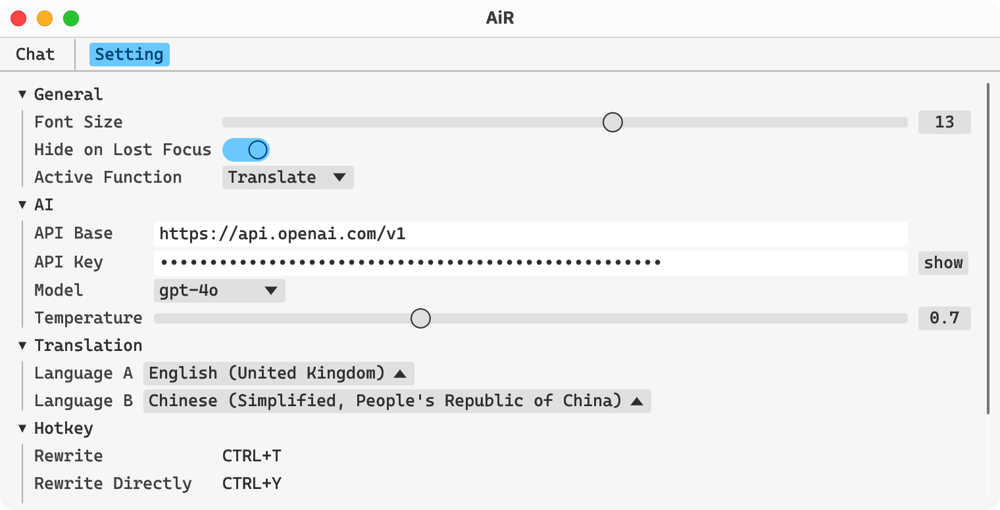
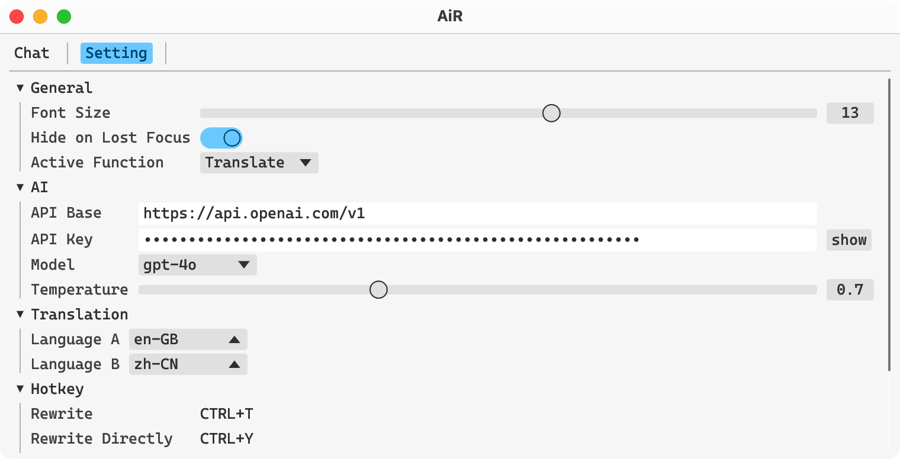
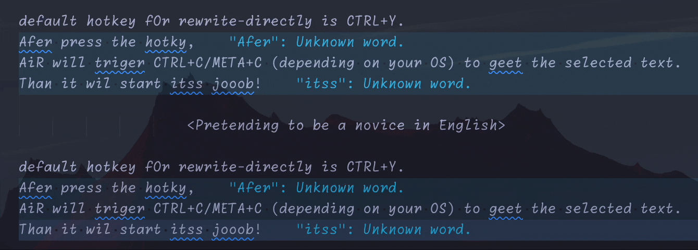
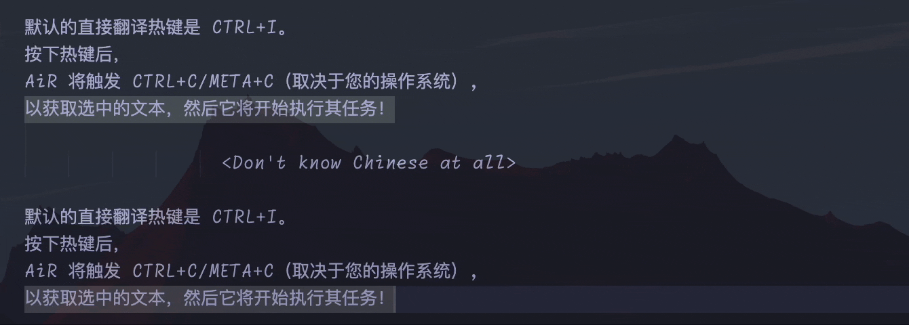
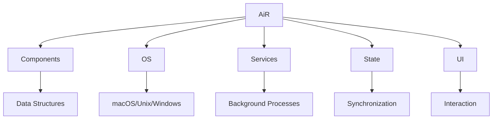

<div align="center">

# AiR
<h3>AI with Rust ｜ </h3>

[](https://www.gnu.org/licenses/gpl-3.0)
[](https://github.com/hack-ink/air/actions/workflows/checks.yml)
[](https://github.com/hack-ink/air/actions/workflows/release.yml)
[](https://github.com/hack-ink/air/tags)
[](https://github.com/hack-ink/air)

Built entirely in Rust, AiR delivers blazing speed and efficiency!

AiR boasts two main features: accurate translation and seamless text rewriting, designed to supercharge your productivity.

AiR is a great assistant for non-native speakers, automatically fixing errors and polishing language to sound like a native speaker.

More awesome features are on the horizon!

[English](README.md) ｜ [中文](README-zh-CN.md)

[](https://github.com/hack-ink/air/pulse)
</div>


## Feature Highlights
### UIs
<div align="center"> </div>

### Rewrite Directly


### Translate Directly



## Status
- **OS**
  - [x] **macOS**
  - [x] **Windows**
  - [ ] **Unix**
- **Features**
  - [x] **Dark/Light Theme**
  - [x] **Rewrite**
  - [x] **Rewrite Directly**
  - [x] **Translate**
  - [x] **Translate Directly**
  - [ ] **Refactor Code** (Coming Soon)
  - [ ] **OCR** (Planed)
  - [ ] **TTS** (Planed)


## Usage
### Installation
#### Build from Source
```sh
# Clone the repository.
git clone https://github.com/hack-ink/air
cd air

# To install Rust on macOS and Unix, run the following command.
#
# To install Rust on Windows, download and run the installer from `https://rustup.rs`.
curl --proto '=https' --tlsv1.2 -sSf https://sh.rustup.rs | sh -s -- --default-toolchain stable

# Install the necessary dependencies. (Unix only)
# Using Ubuntu as an example, this really depends on your distribution.
sudo apt-get update
sudo apt-get install libasound2-dev libxdo-dev

# Build the project, and the binary will be available at `target/release/air`.
cargo build --release

# If you are a macOS user and want to have a `AiR.app`, run the following command.
# Install `cargo-bundle` to pack the binary into an app.
cargo install cargo-bundle
# Pack the app, and the it will be available at `target/release/bundle/osx/AiR.app`.
cargo bundle --release
```

#### Download Pre-built Binary
- **macOS** and **Windows**
  - Download the latest pre-built binary from [GitHub Releases](https://github.com/hack-ink/air/releases/latest).
- **Unix**
  - Planed

### Configuration
#### API Key
**Please configure the API key the first time you run AiR!**

1. `Open AiR.`
2. `Navigate to the "Setting" panel.`
3. `Click the "AI" section.`
4. `Fill in the "API Key" field.`

#### Open a Mac app from an unidentified developer (macOS only)
When you open AiR for the first time, you'll see the following message:

`"AiR" cannot be opened because the developer cannot be verified.`

Since I'm not an identified developer, you need to allow AiR to run on your Mac.

Buy me a coffee so I can get an Apple Developer Certificate. 😄

1. `Open "System Preferences" -> "Privacy & Security".`
2. `Scroll down to the '"AiR" was blocked from use because it is not from an identified developer.' section.`
3. `Click "Open Anyway".`

Relate resources:
- [Open a Mac app from an unidentified developer (support.apple.com)](https://support.apple.com/en-hk/guide/mac-help/mh40616/mac)
- [How to open a Mac app from an unidentified developer (macworld.com)](https://www.macworld.com/article/672947/how-to-open-a-mac-app-from-an-unidentified-developer.html)

#### Gain System Accessibility Permission (macOS only)
To control the keyboard and use the system clipboard for reading and writing data,
AiR must obtain system accessibility permissions.

1. `Open "System Settings" -> "Privacy & Security" -> "Accessibility".`
2. `Click the "+" button and add the "AiR.app" or "air" binary.`

#### Setting
You can configure the settings by navigating to the "Settings" panel.

- General
  - Font Size
  - Hide on Lost Focus: Hide AiR when it loses focus.
  - Active Function: The active function when using non-directly functions.
- AI
  - API Base: The base URL of the AI API. It's crucial to ensure you don't forget the `v1` part. (e.g., https://api.openai.com/v1).
  - API	Key
  - Model
  - Temperature: The unpredictability of AI.
- Translation
  - Language A: The language you want to translate from/to B.
  - Language B: The language you want to translate from/to A.
- Hotkey
  - Rewrite
  - Rewrite Directly
  - Translate
  - Translate Directly
- Development
  - Log Level

AiR is currently under heavy development, and not all settings are always available in the user interface.

However, all settings can always be found in the settings file.

The location of the settings file varies depending on the OS.
- `~/Library/Application\ Support/AiR/setting.toml` (macOS)
- `C:\Users\<username>\AppData\Roaming\hack.ink\AiR\setting.toml` (Windows)
- `~/.config/AiR/setting.toml` (Unix)

### Interaction
- Type the text in the input area and press `META+ENTER` on macOS or `CTRL+ENTER` on other OS to trigger the corresponding function.
- You can also select text and use hotkeys to directly apply the corresponding function to the selected text.

### Update
An automatic update feature is under development.

For now, you can manually update AiR by repeating the installation steps.

#### Re-gain System Accessibility Permission (macOS only)
1. `Follow the "Gain System Accessibility Permission" section to locate the "AiR.app" or "air" binary.`
2. `Click the "-" button to remove the existing permission, then click the "+" button to re-add it.`


## Development
### Architecture
<div align="center">



**Built upon [egui](https://github.com/emilk/egui), a fast and cross-platform GUI toolkit written in pure Rust.**
</div>

- **Components**
  - Provides the basic data structures and functions used by other parts of the program.
  - Component should be static, don't include any mutable state.
- **OS**
  - Provides wrapped APIs to interact with the OS.
  - Differences between OS should be addressed here and presented in a summarized, abstract manner.
- **Services**
  - Provides background tasks ability to run independently of the UI.
  - Service has one or more requirements for a cache component to conserve system resources, perform frequent checks or updates, and handle time-sensitive tasks.
  - Service related to UI settings should provide a hot reload function so that when a setting is changed on UI, the changes are applied immediately.
  - Service should include an abort function to stop the service, and it should be called when exiting the program. to prevent it from stalling.
- **State**
  - Provides mutability that can be synchronized and shared throughout the entire program.
  - State should be `Arc<parking_lot::Mutex/RwLock<_>>` or `Arc<std::sync::atomic::Atomic*>`.
- **UI**
  - Provides the interaction ability of other parts for users.


## Support Me
If you find this project helpful and would like to support its development, you can buy me a coffee!

Your support is greatly appreciated and motivates me to keep improving this project.

- **Fiat**
  - [Ko-fi](https://ko-fi.com/aurevoirxavier)
  - [爱发电](https://afdian.net/a/AurevoirXavier)
- **Crypto**
  - **Bitcoin**
    - `bc1pedlrf67ss52md29qqkzr2avma6ghyrt4jx9ecp9457qsl75x247sqcp43c`
  - **Ethereum**
    - `0x3e25247CfF03F99a7D83b28F207112234feE73a6`
  - **Polkadot**
    - `156HGo9setPcU2qhFMVWLkcmtCEGySLwNqa3DaEiYSWtte4Y`

Thank you for your support!


## Appreciation
We would like to extend our heartfelt gratitude to the following projects and contributors:
- [egui](https://github.com/emilk/egui) for providing the foundation for our GUI.
- The Rust community for their continuous support and development of the Rust ecosystem.


## Additional Acknowledgements
- Google provides an excellent Chinese font, [Noto Serif SC](https://fonts.google.com/noto/specimen/Noto+Serif+SC).
- Microsoft provides an excellent English monospace font, [Cascadia Code](https://github.com/microsoft/cascadia-code).
- [OpenAI Translator](https://github.com/openai-translator/openai-translator) for providing the inspiration for this work.
- The awesome icon created through [recraft.ai](https://app.recraft.ai).


<div align="right">

#### License
<sup>Licensed under [GPL-3.0](LICENSE).</sup>
</div>
